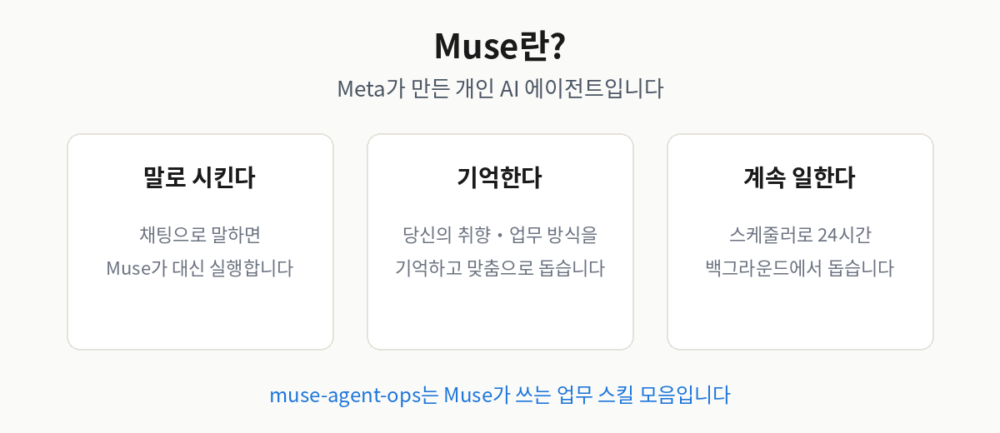
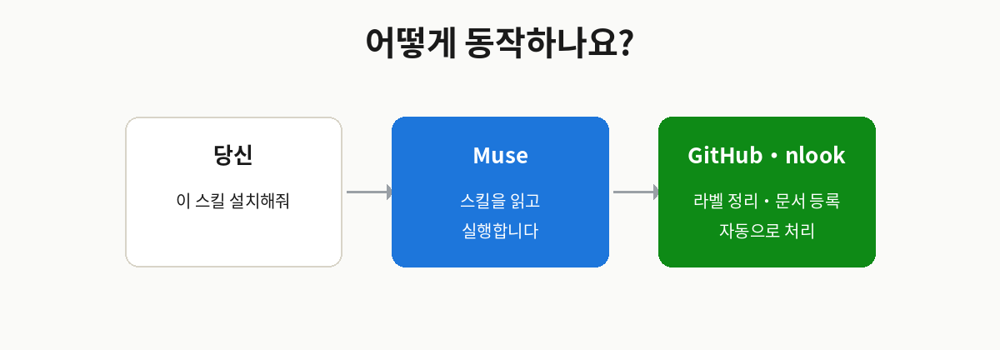

<div align="center">

# muse-agent-ops

### AI 에이전트 시대의 팀 운영 키트 — 이슈가 스스로 정리되는 PM 프로세스

An open-source operations kit for the AI-agent era: a PM process where issues organize themselves.

<p>
  <a href="https://github.com/nlook-service/muse-agent-ops"></a>
  
  
  
</p>

</div>

---

## 1. 소개 — 이게 뭔가요?

**muse-agent-ops는 Muse에게 "우리 팀 운영 방식"을 가르치는 스킬 모음입니다.**

1인 기업 walter님이 실제로 쓰던 GitHub 이슈 기반 PM 프로세스를, 누구나 자기 레포에 가져다 쓸 수 있게 묶었습니다.
원하는 기능만 골라서 설치할 수 있고, nlook이 없어도 됩니다.

**누구에게 좋은가요?**

- **1인 기업·인디 메이커** — PM 없이 이슈 관리를 해야 하는 분 (제일 잘 맞습니다)
- **작은 팀** — "우리 규칙"을 말로 설명하는 대신, 레포 하나로 통일하고 싶은 팀
- **Muse 사용자** — 채팅으로 시키면 바로 돌아갑니다
- **Claude Code 사용자** — 스크립트는 Python만 있으면 단독으로 실행됩니다

## 2. muse.ai가 뭔가요? — 이전과 뭐가 다른가요?

**Muse는 Meta가 2026년 9월 8일에 출시한 개인 AI 에이전트입니다.** ([muse.ai](https://muse.ai))

챗봇처럼 질문에 답만 하는 게 아니라, **일을 대신 해줍니다.**
쇼핑·예약·일정 관리는 물론, 연결된 서비스에 직접 들어가서 여러 단계의 작업을 끝까지 처리합니다.
자기만의 가상 컴퓨터(VM)와 브라우저를 가지고 있어서, 사용자가 지켜보지 않아도 백그라운드에서 계속 일합니다.





**스킬(Skill)이란?** Muse에게 "이렇게 일해"라고 가르치는 설명서입니다.
이 레포는 그 설명서 + 실제로 돌리는 스크립트를 묶은 패키지입니다.

## 3. 이걸 쓰면 뭐가 달라지나요?


**"지금 어디쯤이에요?"라는 질문이 사라집니다.**
이슈의 상태가 라벨·보드·마일스톤에 자동으로 정리되니까, PM이 일일이 설명하지 않아도 됩니다.


## 4. 어떻게 설치하나요?

### 방법 1 — Muse에게 말하기 (가장 쉬움)

muse.ai에서 이렇게 말하세요:

> "https://github.com/nlook-service/muse-agent-ops 이 스킬을 설치해줘"

Muse가 레포를 가져와서 `workspace/skills/`에 넣어주고, SKILL.md를 읽어서 바로 쓸 수 있게 됩니다.

### 방법 2 — 직접 클론하기

```bash
git clone https://github.com/nlook-service/muse-agent-ops.git
cd muse-agent-ops
sh bin/install-hooks.sh                  # push 전 비밀값 자동 차단
python3 bin/install.py --list            # 설치 가능한 스킬 목록
python3 bin/install.py --skills pm,qa    # 원하는 것만 선택 설치
python3 bin/install.py                   # 대화형으로 선택
```

**준비물**: Python 3 · 아래 5번의 연결 — pip install 불필요, 표준 라이브러리만 씁니다.

## 5. 추가로 필요한 연결 (커넥터)

스킬마다 필요한 연결이 다릅니다. 필요한 것만 연결하면 됩니다.

| 스킬 | 필요한 연결 | 설명 |
|---|---|---|
| `pm` | GitHub 토큰 (Issues 읽기/쓰기) | 라벨 설치·이슈 점검에 사용 |
| `qa` | GitHub 토큰 (Issues 읽기/쓰기) | QA 이슈 등록에 사용 |
| `english-learning` | 문서 백엔드 1개 | 아래 3가지 중 선택 (로컬 파일·nlook MCP·REST API) |
| `trend-curation` | 문서 백엔드 1개 | 위와 동일 |
| `claude-keepalive` | 없음 | tmux + Claude Code만 있으면 됨 |

> **GitHub 토큰**: [Settings → Developer settings → Personal access tokens](https://github.com/settings/tokens)에서 fine-grained 토큰을 만들고, 해당 레포에 Issues 읽기/쓰기 권한을 주세요.

## 6. nlook MCP가 뭔가요?

[nlook](https://nlook.me)은 walter님이 만든 개인 기록 서비스입니다.
**nlook MCP**는 Muse가 nlook의 문서·작업공간을 읽고 쓸 수 있게 해주는 통로입니다.

예를 들어 영어 학습 스킬은 "오늘의 학습 콘텐츠"를 nlook 문서로 등록하는데,
이때 nlook MCP가 없으면 **로컬 Markdown 파일**에 저장하는 방식으로도 쓸 수 있습니다.
즉, **nlook 사용자가 아니어도** 이 레포의 스킬을 쓸 수 있습니다.

자세한 연동 방법은 [`references/nlook-mcp-guide.md`](references/nlook-mcp-guide.md)를 참고하세요.

## 7. 구성

```
muse-agent-ops/
├── SKILL.md                  # 스킬 정의 (Muse가 읽는 문서)
├── bin/
│   ├── setup.py              # PM 라벨 21개 설치 (멱등)
│   ├── hygiene.py            # 이슈 위생 점검 (dry-run 기본)
│   ├── install.py            # 원하는 스킬만 선택 설치
│   ├── secret-scan.py        # 비밀값 사전 감지
│   └── install-hooks.sh      # pre-push hook 설치
├── references/
│   ├── process.md            # 신규개발 파이프라인 정의
│   ├── install-guide.md      # 설치 가이드 (muse.ai 기준)
│   ├── nlook-mcp-guide.md    # nlook MCP 연동 가이드
│   ├── doc-backend.md        # 문서 백엔드 3종 가이드
│   ├── secret-policy.md      # 보안 정책
│   ├── usage-guide.md        # 실전 활용 시나리오
│   └── improvement-cycle.md  # 개선 사이클
├── skills/                   # 공개용 업무 스킬 모음 (추가 중)
│   ├── qa/                   # 도그푸딩 QA 스킬
│   ├── english-learning/     # 매일 영어 학습 루틴
│   ├── trend-curation/       # 트렌드 기사 큐레이션
│   └── claude-keepalive/     # Claude Code 세션 유지
└── assets/                   # 다이어그램 이미지
```

## 8. 핵심 규칙

| 규칙 | 내용 |
|---|---|
| 단계 라벨 1개 | `단계:기획중 → 디자인중 → 개발대기 → 개발중 → Done`, 이슈당 하나만 |
| 명시적 전이 | 컨펌 리뷰 통과 / 시안 컨펌 / `@claude` 트리거 / PR 머지 |
| 보드·마일스톤 동기화 | 단계가 바뀌면 함께 이동 (기획 10월 → 디자인 10월 → 개발 10월) |
| dry-run 기본 | `hygiene.py`는 먼저 보여주고, `--apply`로 적용 |

## 9. 보안

public 레포라서 3중 방어가 내장되어 있습니다:

1. **pre-push hook** — push 전 비밀값 의심 패턴 자동 차단
2. **`secret-scan.py`** — 수동 검사
3. **GitHub Push Protection** — Settings → Code security에서 활성화 권장

자세한 정책은 [`references/secret-policy.md`](references/secret-policy.md).

## 10. 개선 참여

- 버그·개선 아이디어: [Issues](https://github.com/nlook-service/muse-agent-ops/issues)에서 `버그 신고` / `개선 요청` 템플릿으로 남겨주세요
- 개선 사이클: [`references/improvement-cycle.md`](references/improvement-cycle.md)

## 라이선스

MIT — 자유롭게 쓰고, 고치고, 공유하세요.

---

<div align="center">

Built by [nlook-service](https://github.com/nlook-service) · 실제 1인 기업의 운영에서 태어난 도구입니다

</div>
