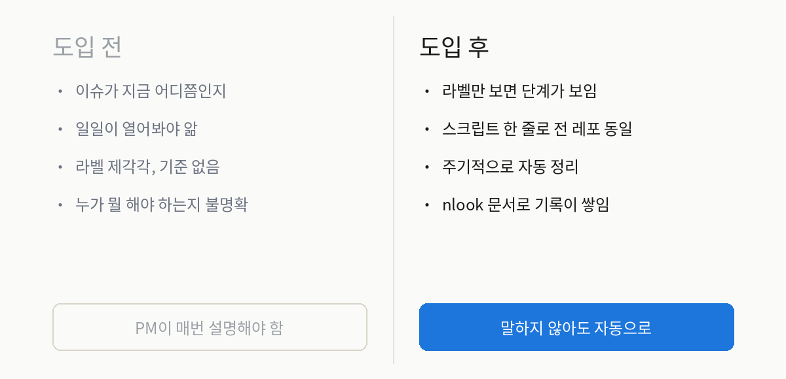
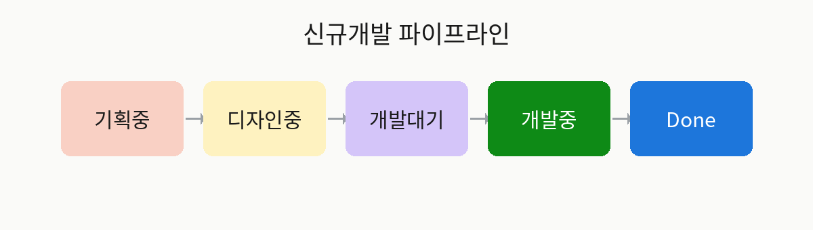

<div align="center">

# muse-agent-ops

### AI 에이전트 시대의 팀 운영 키트 — 이슈가 스스로 정리되는 PM 프로세스

An open-source operations kit for the AI-agent era: a PM process where issues organize themselves.

<p>
  <a href="https://github.com/nlook-service/muse-agent-ops"></a>
  
  
  
</p>

</div>

---

## 이걸 쓰면 뭐가 달라지나요?



**"지금 어디쯤이에요?"라는 질문이 사라집니다.**
이슈의 상태가 라벨·보드·마일스톤에 자동으로 정리되니까, PM이 일일이 설명하지 않아도 됩니다.



## 구성

```
muse-agent-ops/
├── SKILL.md                  # 스킬 정의 (Muse가 읽는 문서)
├── bin/
│   ├── setup.py              # PM 라벨 21개 설치 (멱등)
│   ├── hygiene.py            # 이슈 위생 점검 (dry-run 기본)
│   ├── secret-scan.py        # 비밀값 사전 감지
│   └── install-hooks.sh      # pre-push hook 설치
├── references/
│   ├── process.md            # 신규개발 파이프라인 정의
│   ├── install-guide.md      # 설치 가이드 (muse.ai 기준)
│   ├── nlook-mcp-guide.md    # nlook MCP 연동 가이드
│   ├── secret-policy.md      # 보안 정책
│   └── improvement-cycle.md  # 개선 사이클
├── skills/                   # 공개용 업무 스킬 모음 (추가 중)
└── assets/                   # 다이어그램 이미지
```

## 3분 설치 — 원하는 것만 골라서

**준비물**: Python 3 · 스킬별 필요한 연결(아래 표) — pip install 불필요, 표준 라이브러리만 씁니다.

```bash
git clone https://github.com/nlook-service/muse-agent-ops.git
cd muse-agent-ops
sh bin/install-hooks.sh                  # push 전 비밀값 자동 차단
python3 bin/install.py --list            # 설치 가능한 스킬 목록
python3 bin/install.py --skills pm,qa    # 원하는 것만 선택 설치
python3 bin/install.py                   # 대화형으로 선택
```

| 스킬 | 필요한 연결 |
|---|---|
| `pm` / `qa` | GitHub 토큰 (Issues 읽기/쓰기) |
| `english-learning` / `trend-curation` | 문서 백엔드 1개 (로컬 파일·nlook MCP·REST API 중 선택) |
| `claude-keepalive` | 없음 (tmux + Claude Code) |

nlook이 없어도 됩니다. 문서 백엔드는 로컬 파일로 시작할 수 있습니다.
자세한 건 [`references/install-guide.md`](references/install-guide.md).

## 핵심 규칙

| 규칙 | 내용 |
|---|---|
| 단계 라벨 1개 | `단계:기획중 → 디자인중 → 개발대기 → 개발중 → Done`, 이슈당 하나만 |
| 명시적 전이 | 컨펌 리뷰 통과 / 시안 컨펌 / `@claude` 트리거 / PR 머지 |
| 보드·마일스톤 동기화 | 단계가 바뀌면 함께 이동 (기획 10월 → 디자인 10월 → 개발 10월) |
| dry-run 기본 | `hygiene.py`는 먼저 보여주고, `--apply`로 적용 |

## 보안

public 레포라서 3중 방어가 내장되어 있습니다:

1. **pre-push hook** — push 전 비밀값 의심 패턴 자동 차단
2. **`secret-scan.py`** — 수동 검사
3. **GitHub Push Protection** — Settings → Code security에서 활성화 권장

자세한 정책은 [`references/secret-policy.md`](references/secret-policy.md).

## 개선 참여

- 버그·개선 아이디어: [Issues](https://github.com/nlook-service/muse-agent-ops/issues)에서 `버그 신고` / `개선 요청` 템플릿으로 남겨주세요
- 개선 사이클: [`references/improvement-cycle.md`](references/improvement-cycle.md)

## 라이선스

MIT — 자유롭게 쓰고, 고치고, 공유하세요.

---

<div align="center">

Built by [nlook-service](https://github.com/nlook-service) · 실제 1인 기업의 운영에서 태어난 도구입니다

</div>
